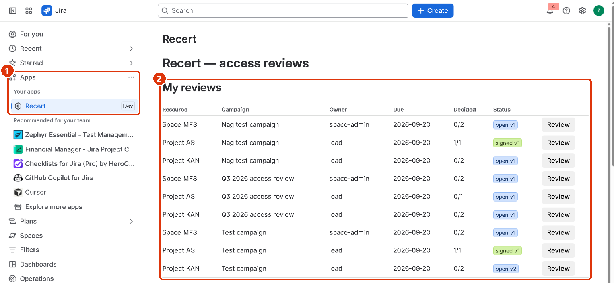
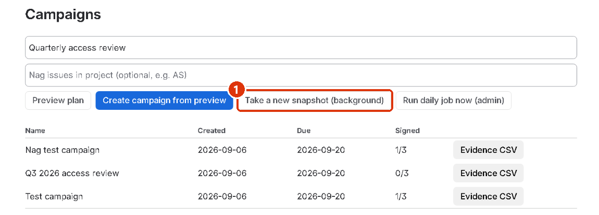
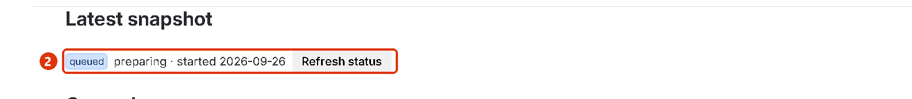
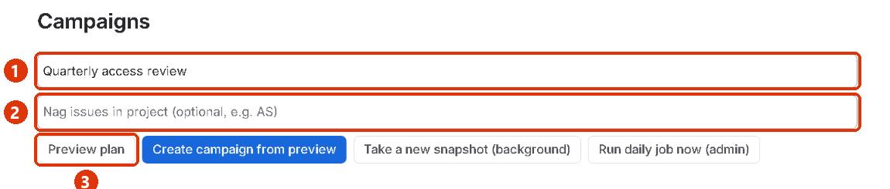
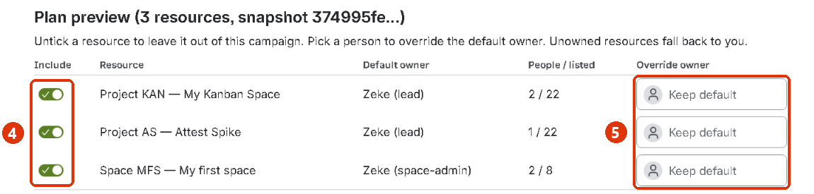
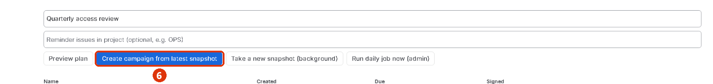
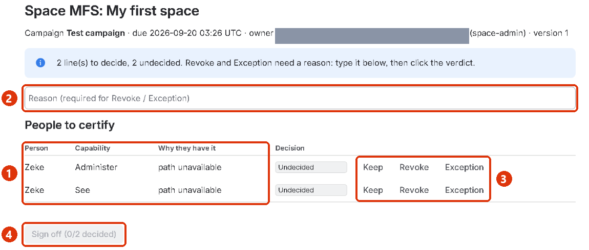
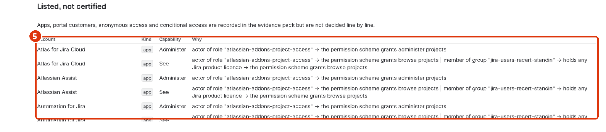
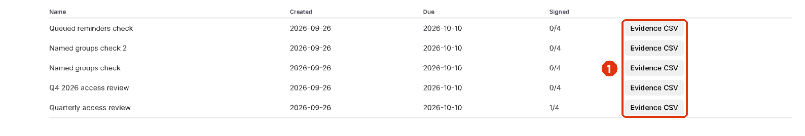
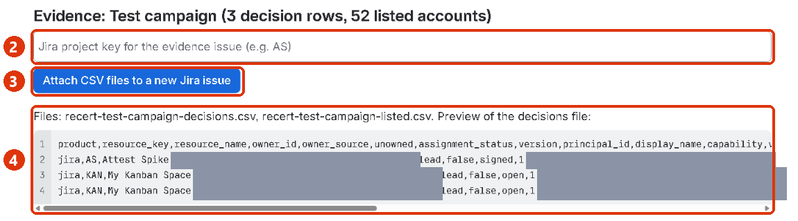

# Getting started with Recert

<a class="pdf" href="assets/Recert-Getting-Started.pdf">Download this guide as a PDF</a>

  <h2>Watch it work (1 minute, no sound)</h2>
  <video controls preload="metadata" poster="assets/img/open-recert.png" width="100%">
    <source src="assets/recert-demo.mp4" type="video/mp4">
    Your browser cannot play this video. <a href="assets/recert-demo.mp4">Download it instead.</a>
  </video>
  
Snapshot, campaign, a reviewer's keep and revoke decisions, sign-off, and the evidence export, in one pass.

Recert runs an access review of your Jira projects and Confluence spaces. It works out who
can see or administer each one and why, sends each review to the person who owns that
project or space, records every keep / revoke / exception decision with a reason and a
timestamp, and exports the evidence for your auditor.

**How to read the pictures.** The red numbers in each picture match the numbered steps
next to it. Click any picture to open it full size.

**Who does what.** A **Jira administrator** takes snapshots, creates campaigns, reopens
signed reviews and exports evidence. A **reviewer** (the project lead or space
administrator) only decides the lines assigned to them and signs off. Nothing in Recert
changes anyone's access; your administrators carry out revocations in Jira or Confluence as
usual.

**Before you start.** Install Recert from the Atlassian Marketplace on your Jira Cloud site
and accept the requested permissions. Confluence spaces on the same site are reviewed from
this one installation; you do not need a separate Confluence install.

**Messages appear at the top of the Recert page**, not next to the button you clicked. If
nothing seems to happen, scroll up.

## 1. Open Recert

1. In Jira's left sidebar, open **Apps**, then click **Recert**.
2. **My reviews** lists every review assigned to you, with its campaign, due date, how many
   lines are decided, and its status (*open* or *signed*). Click **Review** on a row to
   open it.

On a fresh install the tables are empty and Recert says *"No campaigns yet. Take a
snapshot, then create one."* That is expected; go to step 2.

## 2. Take a snapshot (Jira administrator)

A snapshot records who has access to every project and space at this moment, and through
which group, role or permission. Every review is made against a snapshot, so the evidence
can be reproduced later.

1. Scroll down to **Campaigns** and click **Take a new snapshot (background)**.

{:start="2"}
2. A blue message appears at the top of the page: *"Snapshot started. It runs in the
   background; use Refresh status below to watch it. A campaign can be created once it says
   ready."* Under **Latest snapshot** a status lozenge and a progress line (*"12 of 40
   resources · started 2026-09-25"*) show how far it has got; click **Refresh status** until
   it reads *ready*. Usually a minute or two, longer on large sites. If the lozenge reads
   *failed*, that snapshot cannot be used for a campaign — take a new one.

If you create a campaign before the snapshot is ready, Recert answers *"no ready snapshot;
create one first"*. Wait a minute and try again. Snapshots that no campaign uses are deleted
automatically after 90 days.

## 3. Plan and create a campaign (Jira administrator)

A campaign sends one review per project or space to its owner.

1. Type a name for the campaign, for example *Q4 2026 access review*.
2. Optional, **Reminder issues in project**: type a Jira project key (for example `OPS`). Recert
   then creates one Jira issue per review in that project, assigned to the reviewer, so
   Jira's own notifications remind them. Each issue is resolved automatically when its
   review is signed off.
3. Click **Preview plan**. A **Plan preview** table appears below the campaign list, with
   one row per project and space and its default owner: the **project lead** for Jira
   projects, the first **space administrator** for Confluence spaces. A resource with no
   eligible owner is assigned to you and marked *unowned*.

{:start="4"}
4. **Include**: switch a row off to leave that project or space out of this campaign.
5. **Override owner**: pick a person to send that review to someone other than the
   default owner.

{:start="6"}
6. Scroll back up and click **Create campaign from preview**. If you skipped the preview,
   the same button reads **Create campaign from latest snapshot**.

Recert confirms how many reviews it created. Reviews are due 14 days later. Each reviewer
now sees their reviews under **My reviews**, and the campaign appears in the **Campaigns**
list with a *Signed* count.

## 4. Review and sign off (reviewer)

Open **Apps → Recert**, find the row under **My reviews** and click **Review**. A review of
a Jira project can also be opened from the **Recert** tab inside that project.

1. **People to certify** lists each person with access, what they can do (*See* or
   *Administer*) and *Why they have it* (the group, role or permission that grants it).
2. To revoke or record an exception, first type the reason in the **Reason** box.
3. Then click **Keep**, **Revoke** or **Exception** on that person's line. Keep needs no
   reason. Each decision is saved with your name and the time (UTC).
4. When every line is decided, click **Sign off**. It shows how many lines are decided and
   stays greyed out until all are. Decisions are then locked.

{:start="5"}
5. Below the Sign off button, **Listed, not certified** shows apps, portal customers,
   anonymous access and conditional access (for example "the assignee of an issue"). They
   are included in the evidence, but you do not decide them.

Only a Jira administrator can **Reopen** a signed review. Reopening creates a new version
and keeps the earlier decisions visible as *Superseded*, so evidence is never silently
changed.

## 5. Export the evidence (Jira administrator)

1. In the **Campaigns** list, click **Evidence CSV** on the campaign's row.

{:start="2"}
2. An **Evidence** section appears. Type the key of the Jira project where the evidence
   should be filed.
3. Click **Attach CSV files to a new Jira issue**. Recert creates an issue named
   *Evidence pack: &lt;campaign&gt;* in that project with both files attached. Download
   them from the issue and give them to your auditor.
4. The two files and a preview of the first are shown here so you can check them before
   attaching:
   - `<campaign>-decisions.csv`: every certified line with its decision, reason, who
     decided and the sign-off.
   - `<campaign>-listed.csv`: the accounts that were listed but not certified.

## Reminders and the daily job

Once a day Recert comments on open reminder issues — seven days before the due date, the day
before, and once a review is overdue — deletes snapshots older than 90 days that no campaign
uses, and reports the accounts it stores to Atlassian so display names stay current and closed
accounts are erased. A reminder issue is resolved as soon as its review is signed off, not by
this job. **Run daily job now (admin)**, next to the snapshot button, runs the same job
immediately; the message it prints is the job's summary.

## Where the data lives

Everything Recert stores stays in your Atlassian site's Forge storage. The app makes no
calls outside Atlassian and the vendor has no access to your data. Details are in the
[privacy policy](privacy.html) and the [security policy](security.html).

## Troubleshooting

| You see | Cause and fix |
|---|---|
| Nothing happens when I click a button | The message is at the top of the Recert page. Scroll up. |
| *Only Jira administrators can create campaigns* | Snapshots, campaigns, reopen and evidence export need Jira administrator rights. Ask an admin, or grant the role. |
| *no ready snapshot; take one first* | No snapshot has finished yet. Click **Take a new snapshot (background)**, wait a minute or two, then create the campaign. |
| *Nothing assigned to you* | You do not own any review in an open campaign. Owners are the project lead or space administrator unless an admin overrode them. |
| A project or space is missing from the preview | It was not in the latest snapshot. Take a new snapshot after creating projects or spaces. |
| **Sign off** is greyed out | Some lines are still *Undecided*. The button shows how many are decided. |
| *Why they have it* says *path unavailable* | The access path could not be reconstructed for that line (typical for some team-managed projects). The decision still records normally. |
| The reminder issue was not created | The **Reminder issues in project** key must be a project the app can create issues in. The issues are created in the background, so wait a minute and check the project; the campaign message reports a queueing failure. |
| *"The Recert licence for this site is inactive or expired"* | The trial or subscription has lapsed. Snapshots, campaigns and evidence export stop; reviews already open can still be decided and signed off. Renew in Atlassian administration. |
| *"Only the owner of this review or a Jira administrator may view it"* | Reviews are visible to the person they were routed to, the person who created the campaign, and Jira administrators. |
| *"Could not check your Jira permissions"* | Jira was busy when the app asked whether you administer it. Wait a moment and try again. |

Questions: see the [support page](support.html) or email support@recert.dev.
