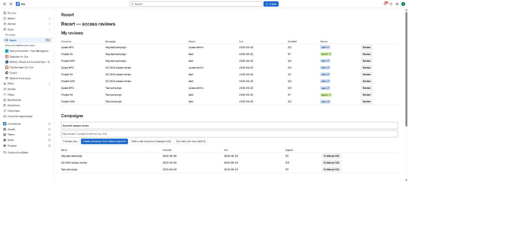
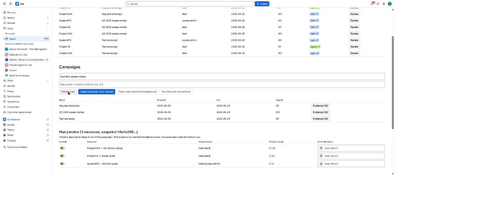
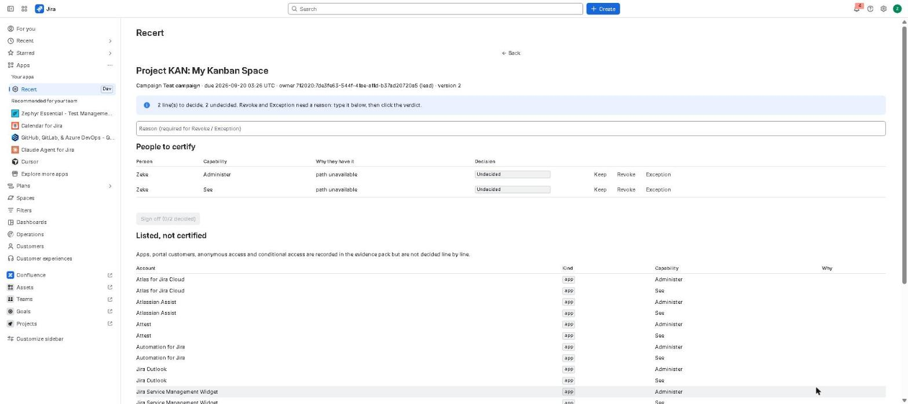
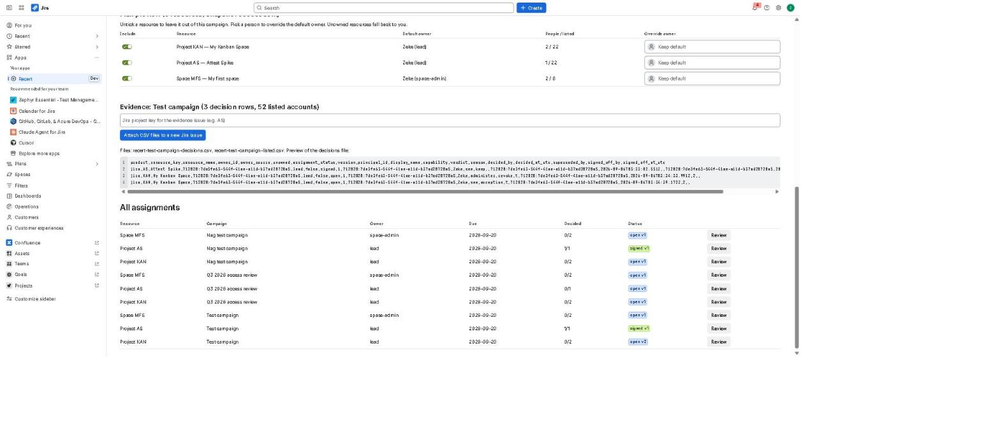

# Getting started with Recert

Recert runs an access review of your Jira projects and Confluence spaces: it works out who
can see or administer each one and why, sends each review to the person who owns that
project or space, records every keep / revoke / exception decision with a reason and a
timestamp, and exports the evidence. This page walks through one complete review.

**Roles.** A **Jira administrator** takes snapshots, creates campaigns, reopens signed
reviews and exports evidence. A **reviewer** (the project lead or space administrator) only
decides the lines assigned to them and signs off. Nothing in Recert changes anyone's access;
revocations are carried out by your administrators in Jira or Confluence as usual.

## 1. Install and open the app

1. Install Recert from the Atlassian Marketplace on your Jira Cloud site and accept the
   requested scopes. Confluence spaces on the same site are reviewed from this one
   installation; you do not need a separate Confluence install.
2. In Jira, open **Apps → Recert** from the left sidebar. This is the Recert home page.
3. On a fresh install the tables are empty and the app says *"No campaigns yet. Take a
   snapshot, then create one."* That is expected.

## 2. Take a snapshot

A snapshot is a point-in-time record of who has access to every project and space, and
through which group, role or permission. Reviews are always made against a snapshot so
that the evidence can be reproduced later.

1. On the home page, click **Take a new snapshot (background)**. You must be a Jira
   administrator.
2. The app confirms *"Snapshot job started"*. It runs in the background and usually
   finishes in a minute or two; large sites take longer.
3. There is nothing to click while it runs. If you try to create a campaign before it is
   ready, the app answers *"no ready snapshot; take one first"* — wait and try again.

Snapshots not used by any campaign are deleted automatically after 90 days.

## 3. Preview the plan (optional)

1. Enter a campaign name in the first box (the default is *Quarterly access review*).
2. Click **Preview plan**. The app lists every project and space in the latest snapshot
   with its default owner: the **project lead** for Jira projects, the first **space
   administrator** for Confluence spaces. A resource with no eligible owner is assigned to
   you and flagged *unowned*.
3. Untick **Include** to leave a resource out of this campaign, or pick a person under
   **Override owner** to route that review to someone else.

## 4. Create the campaign

1. Optional: type a Jira project key (for example `AS`) in **Nag issues in project** and
   Recert will create one Jira issue per review in that project, assigned to the reviewer,
   so Jira's own notifications remind them. The issue is resolved automatically when the
   review is signed off.
2. Click **Create campaign from preview** (or **Create campaign from latest snapshot** if
   you skipped the preview).
3. The app confirms how many assignments were created. Reviews are due 14 days after
   creation. Each reviewer now sees their reviews under **My reviews** when they open
   **Apps → Recert**; the campaign appears under **Campaigns** with a signed-off count.

## 5. Review and sign off

Reviewers open **Apps → Recert**, find the row under **My reviews** and click **Review**.
A review of a Jira project can also be opened from the **Recert** tab inside that project.

1. **People to certify** lists every person with unconditional access, the capability
   (*See* or *Administer*) and *Why they have it* (the group, role or permission path).
2. For each line click **Keep**, **Revoke** or **Exception**. Revoke and Exception require
   a reason: type it in the **Reason** box first, then click the verdict. Each decision is
   recorded with the reviewer's account and a UTC timestamp.
3. **Listed, not certified** shows apps, portal customers, anonymous access and conditional
   access. These are recorded in the evidence but are not decided line by line.
4. When every line is decided, click **Sign off**. Decisions are then locked.
5. Only a Jira administrator can **Reopen** a signed review; that creates a new version and
   keeps the earlier decisions visible as *Superseded*, so evidence is never silently
   changed.

## 6. Export the evidence

1. On the home page, under **Campaigns**, click **Evidence CSV** next to the campaign.
2. Recert shows two files, `<campaign>-decisions.csv` (every certified line with its
   decision, reason, decider and sign-off) and `<campaign>-listed.csv` (the accounts listed
   but not certified), with a preview of the decisions file.
3. Type a Jira project key and click **Attach CSV files to a new Jira issue**. Recert creates
   an issue named *Evidence pack: <campaign>* in that project with both files attached.
   Download them from the issue and hand them to your auditor.

## Reminders and the daily job

Once a day Recert resolves reminder issues for reviews that were signed off and refreshes
display names from Atlassian. **Run daily job now (admin)** on the home page runs the same
job immediately; the message it prints is the job's summary.

## Where the data lives

Everything Recert stores stays in your Atlassian site's Forge storage. The app makes no
calls outside Atlassian and the vendor has no access to your data. Details are in the
[privacy policy](privacy.html) and the [security policy](security.html).

## Troubleshooting

| You see | Cause and fix |
|---|---|
| *Only Jira administrators can create campaigns* | Snapshots, campaigns, reopen and evidence export need Jira administrator rights. Ask an admin, or grant the role. |
| *no ready snapshot; take one first* | No snapshot has finished yet. Click **Take a new snapshot (background)**, wait a minute or two, then create the campaign. |
| *Nothing assigned to you* | You are not the owner of any review in an open campaign. Owners are the project lead or space administrator unless an admin overrode them. |
| A project or space is missing from the preview | It was not in the latest snapshot. Take a new snapshot after creating projects or spaces. |
| *Why they have it* says *path unavailable* | The access path could not be reconstructed for that line (typical for some team-managed projects). The decision still records normally. |
| The reminder issue was not created | The nag project key must be a project the app can create issues in; check the campaign creation message for warnings. |

Questions: see the [support page](support.html).
